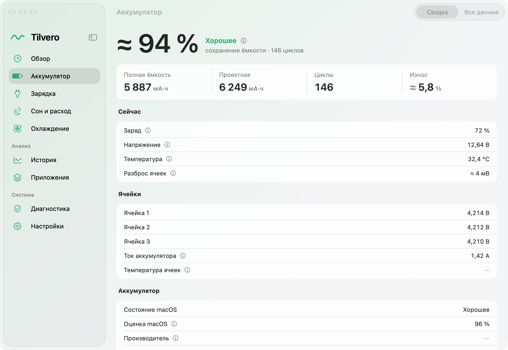

<p align="center">
  <a href="https://github.com/RaNDoM6913/Tilvero/releases/latest"></a>
  <a href="docs/GITHUB_TRAFFIC.md"></a>
  <a href="LICENSE"></a>
</p>

<p align="center"><a href="README.md">English</a> · <strong>Русский</strong></p>

Tilvero живёт в строке меню. Одно быстрое меню показывает батарею и питание,
не даёт Mac уснуть или усыпляет его по таймеру и задаёт лимит зарядки macOS,
а подробности — в удобном нативном окне. Без аккаунта и облачного сервиса.


<sub>Обзор · Таймер сна · Не засыпать со строкой «Экран и звук» · Заряд. Отрисовано из исходников с подставленными тестовыми показаниями;
они не подтверждают поддержку аппаратного управления и не квалифицируют релизное приложение.</sub>

## Что умеет быстрое меню

- **Обзор:** заряд и состояние батареи, лимит зарядки macOS одним взглядом, «Не засыпать» в одно нажатие
  и живые графики мощности (адаптер и батарея на одном графике) и температуры; ниже карточка сохранения ёмкости (циклы, износ и ёмкости).
  Выберите готовую раскладку («Минимум», «Энергия», «Всё») или соберите свою в Настройки > Быстрое меню: добавляйте, скрывайте и переставляйте блоки, задавайте размер каждого графика.
  Блок «Время до 20%» показывает оценку времени работы от батареи. Кнопки длительности и уровня в разделе «Сон» меняются там же.
- **Сон:** таймер сна, который можно продлить на 5 минут, 15 минут или час; «Не засыпать» на время или пока вы не остановите,
  с необязательным переключателем **«С закрытой крышкой»**, который заодно приглушает экран и ограничивает громкость, пока крышка закрыта;
  сон или «не засыпать» при падении заряда до выбранного уровня.
- **Заряд:** лимит зарядки macOS (80–100 %), разовая зарядка до 100 % и **зарядка к времени**: выберите время и уровень,
  и Tilvero поднимет лимит как раз вовремя, разбудив спящий Mac по расписанию (одно необязательное разрешение администратора;
  пробуждение с закрытой крышкой ещё проверяется на реальном железе).
- **Первый запуск:** на совсем новой установке открывается одно окно настройки (запуск при входе, история, режим закрытой крышки
  и «Зарядить к времени»). Уже установленные копии его не показывают.

**Новейшая версия: [исходники 0.8.1](https://github.com/RaNDoM6913/Tilvero/releases/tag/v0.8.1) для разработчиков.**
[Получить исходники](https://github.com/RaNDoM6913/Tilvero/releases/download/v0.8.1/Tilvero-0.8.1-source.zip)
· [Описание выпуска и контрольные суммы](https://github.com/RaNDoM6913/Tilvero/releases/tag/v0.8.1)
· [Сборка и запуск](#сборка-и-запуск) · [План развития](ROADMAP.md)
· Ранее: [0.8.0](https://github.com/RaNDoM6913/Tilvero/releases/tag/v0.8.0),
[0.7.1](https://github.com/RaNDoM6913/Tilvero/releases/tag/v0.7.1)

Подписанная и нотарифицированная версия для Mac готовится. Планируемый DMG
**Monitoring Preview** будет работать только для чтения; в репозитории также
есть управление для разработки с отдельными проверками допуска.
[Доступность и установка](docs/INSTALL.md#русский).

## Что нового в 0.8.1

Перестроенный **конструктор быстрого меню**, переработанный блок **«Время до 20%»** и исправление тёмной темы.

**Новое**
- **Перестроенный конструктор быстрого меню** (Настройки > Быстрое меню). Выберите готовую раскладку (**«Минимум»**, **«Энергия»**, **«Всё»**) или **«Своё»**; ваша раскладка сохраняется, когда вы применяете готовую, и возвращается кнопкой «Своё». Список **«В меню»** показывает только включённые блоки: перетащите блок целиком, чтобы переставить, (−) скрывает его. В **«Можно добавить»** скрытые блоки лежат плашками; нажмите на плашку, чтобы добавить блок. У каждого блока с графиком свой размер графика («Полоска», «Компактный» или «Обычный») в настройках блока, поэтому общего выбора размера больше нет. Блок, который вы редактируете или на который навели курсор, обведён в предпросмотре, а счётчик высоты меню (≈) сравнивает высоту предпросмотра с экраном. Предпросмотр теперь использует настоящие вкладки быстрого меню и настоящие страницы «Сон» и «Заряд».
- **Переработанный блок «Время до 20%».** По умолчанию одна строка: значок часов, оценка времени (≈), время, к которому заряд дойдёт до 20 % («к ≈ 05:05»), и текущий уровень. В настройках блока его можно переключить на небольшой график наблюдавшегося разряда с пунктирной экстраполяцией до 20 %. Без прогноза блок пишет «Собираю данные» вместо прочерка.

**Изменено**
- **Прогноз переживает перезапуск приложения.** Раньше он начинался заново при каждом запуске Tilvero. Теперь он продолжается через короткий промежуток перезапуска, если ничего не было пропущено; сон, замена батареи и смена часов по-прежнему начинают его заново.
- **Вкладки страниц в панели инструментов** («Настройки», «Аккумулятор», «Сон и расход») переключаются плавно: страница сменяется после того, как переключатель доедет, а не замораживает его.

**Исправлено**
- Блок «Блоки обзора» в Настройки > Быстрое меню в тёмной теме был пустой белой рамкой с невидимыми подписями. Теперь он следует теме окна.

**Известные ограничения.** На реальном Mac пока не проверены: знак мощности батареи вживую при зарядке от сети, пробуждение спящего Mac для «Зарядить к времени» и новое окно на macOS 26 (видели только на macOS 27.2).

## Что было нового в 0.8.0

Переработанное главное окно с боковой колонкой и девятью страницами, страж для **«С закрытой крышкой»** (проверен на реальном Mac: после `kill -9` обычный сон вернулся меньше чем за секунду), мощность батареи вживую раз в секунду, обновлённое и более быстрое хранилище истории (схема 3, с закрытой копией перед обновлением) и новая иконка приложения. Подробности в [CHANGELOG](CHANGELOG.md).

Вся история: [CHANGELOG](CHANGELOG.md).

## Не только меню: Ваш Mac в подробностях

| Раздел | Что показывает Tilvero |
| --- | --- |
| Батарея одним взглядом | Заряд и источник питания в строке меню; компактная панель с настройкой блоков и размера индикатора |
| Состояние батареи | Доступные ёмкость, температура, циклы и данные ячеек с источниками и временем измерения |
| Питание и зарядка | Раздельные мощность батареи, системная нагрузка и вход/возможности адаптера; чтение системного лимита зарядки |
| Приложения | Поиск процессов, нагрузка CPU, оценки энергии/мощности CPU, пробуждения и дисковый ввод-вывод с явным указанием неполных данных |
| История и отчёты | Локальные графики, минутные записи, часовые сводки и экспорт CSV/JSON с предпросмотром; разрывы остаются видимыми |
| Сон и разряд | Наблюдавшиеся приложением сон и пробуждение, текущие препятствия сну и явные отметки неполных данных |
| Удобная панель | Порядок и видимость блоков, русский и английский языки, размер значка и текста в строке меню |

Каталог описывает **115 полей**. Их доступность зависит от конкретного Mac;
отсутствующие показания остаются недоступными. Мониторингу не нужны права администратора.

## Главное окно

**«История и отчёты…»** открывает главное окно: стеклянную боковую колонку (она сужается до полосы значков) и девять страниц.
Нативный интерфейс отрисован из исходников с подставленными тестовыми показаниями на временном хранилище истории, это не данные реального Mac.
Эти снимки не подтверждают поддержку аппаратного управления или квалификацию релизного приложения.

<table>
  <tr>
    <td width="50%"><strong>Обзор</strong><br><a href=".github/assets/screenshots/ru/overview.png"></a></td>
    <td width="50%"><strong>Батарея</strong><br><a href=".github/assets/screenshots/ru/battery.png"></a></td>
  </tr>
  <tr>
    <td width="50%"><strong>История</strong><br><a href=".github/assets/screenshots/ru/history.png"></a></td>
    <td width="50%"><strong>Зарядка</strong><br><a href=".github/assets/screenshots/ru/charging.png"></a></td>
  </tr>
</table>

## Сборка и запуск

Нужны **Mac с Apple silicon, macOS 26.0+ и полная установка Xcode** с совместимым
macOS SDK и Swift 6. Отдельные Command Line Tools не являются проверенным путём сборки.

```sh
git clone --branch v0.8.1 https://github.com/RaNDoM6913/Tilvero.git
cd Tilvero
bash scripts/test.sh
bash scripts/build-local-app.sh
bash scripts/run-local.sh
```

Приложение открывается в строке меню; на совсем новой установке сначала появляется окно первого запуска. Нажмите на значок батареи для быстрого меню;
**«История и отчёты…»** открывает главное окно, шестерёнка — настройки.
В Tilvero сочетание **⌘⌥B** переключает панель, **⌘,** открывает настройки.

Локальная сборка подписывается ad-hoc для разработки. Сборщик сохраняет работающую
копию; чтобы оставить существующую сборку, укажите новый каталог:

```sh
bash scripts/build-local-app.sh --output build/dev-candidates.noindex/my-build/Tilvero.app
```

Указанный путь не должен существовать. Запускайте одну копию для разработки.
[Установка и обновление](docs/INSTALL.md#русский) описывает хранение данных и будущий DMG.

## Границы предварительной версии

**Мощность приложения — оценка для CPU.** Полное электрическое потребление
приложения с учётом GPU и других устройств не измеряется. Получение текущего
Energy Impact macOS не реализовано. Закрытый доступ не превращает значение в ноль.

**Отчёты сна начинаются с наблюдавшихся событий.** Tilvero не восстанавливает
прошлые ночи по разрывам истории и не приписывает их расход отдельным приложениям.

**Управление требует отдельного допуска.** В исходниках есть «Не давать Mac
уснуть», таймер сна, сохраняемые режимы и нативный контроллер зарядки. Сохранение
режима не применяет его. Лимит зарядки, разовая полная зарядка и зарядка к времени
используют настройку зарядки macOS и локальную проверку записи, чтения и восстановления
на конкретном Mac; ваш собственный лимит всегда важнее любого плана. Зарядка к времени
может запросить одно необязательное разрешение администратора (`pmset schedule wake`),
чтобы разбудить спящий Mac; поведение пробуждения на реальном устройстве, в том числе
с закрытой крышкой, ещё не проверено.
Привилегированная запись зарядки, режимов питания и вентиляторов пока не квалифицирована.
Вентиляторы по умолчанию остаются под управлением системы.

Будущая конфигурация Monitoring Preview отключает предотвращение сна и действия
управления и не содержит привилегированного помощника. Обычная сборка исходников —
версия для разработки со своими проверками допуска. Симуляция явно помечена
**DEMO** и отделена от реальной истории. Подробности:
[совместимость](docs/COMPATIBILITY.md) и [архитектура управления](Helper/README.md).

## Данные остаются на Mac

Без аккаунта, облака и отправки телеметрии. История батареи хранится локально;
по умолчанию подробные записи сохраняются 30 дней, часовые сводки — до 365 дней.
В настройках можно сократить срок подробной истории или удалить её.

Идентификация процессов остаётся в памяти и исключена из истории батареи
и обычного диагностического экспорта. Серийные номера и идентификационные токены
скрыты в обычном интерфейсе. Просмотрите отчёт перед тем, как поделиться им.

## Помогите улучшить Tilvero

- [Сообщить об ошибке или предложить улучшение](https://github.com/RaNDoM6913/Tilvero/issues/new/choose)
- [Участие в разработке](CONTRIBUTING.md) — подготовка, модули и безопасные проверки
- [История изменений](CHANGELOG.md) · [План развития](ROADMAP.md) · [Совместимость](docs/COMPATIBILITY.md)
- [Подготовка выпуска](docs/RELEASING.md) · [Тестирование и проверки](docs/TESTING.md)

В сообщении об ошибке укажите модель Mac, версию macOS и версию исходников.
Перед приложением диагностики проверьте её на личные данные.

## Лицензия

Авторские права © 2026 [RaNDoM6913](https://github.com/RaNDoM6913).
Оригинальные исходники Tilvero, документация и графика репозитория используют
[GNU GPL только версии 3](LICENSE) (`GPL-3.0-only`). Сохраняйте уведомления
об авторстве и лицензии; при распространении производных работ выполняйте
требования GPL к исходному коду и той же лицензии.

Сторонние материалы сохраняют собственные уведомления:
[COPYRIGHT](COPYRIGHT) · [Сторонние материалы](THIRD_PARTY_NOTICES.md).

Оформление: [происхождение баннера](.github/assets/COVER_PROMPT.md).
